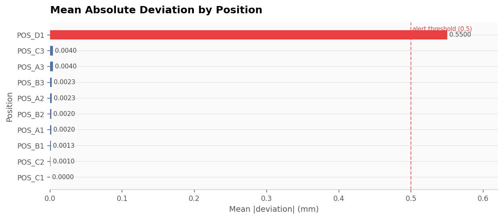
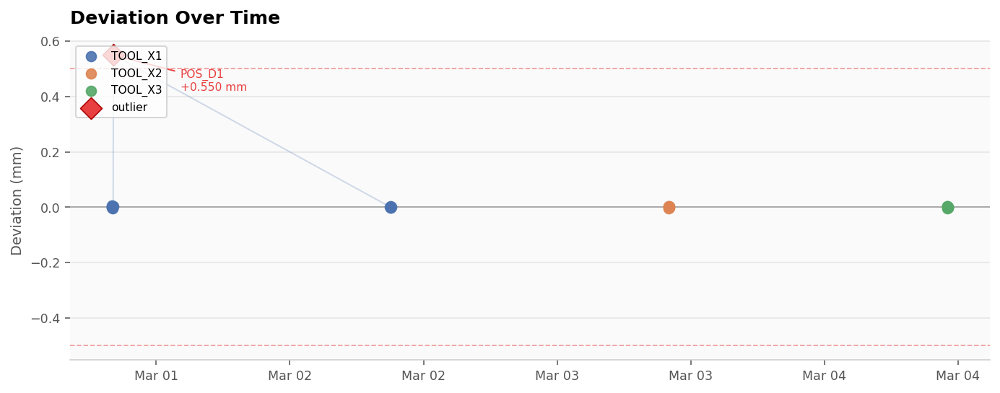
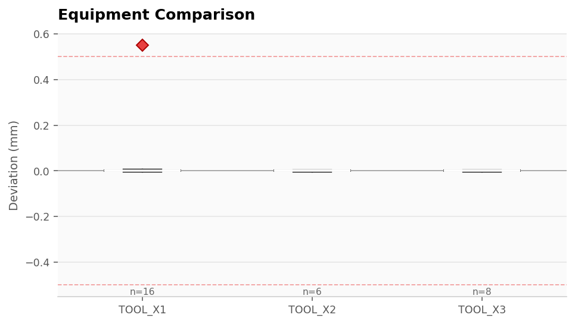
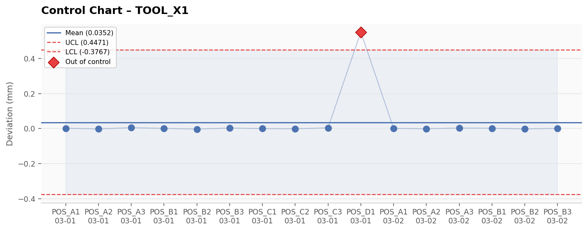

# Calibration-Pipeline

ETL pipeline for equipment position calibration data. Reads CSV, Excel, JSON, and log files, validates measurements, loads them into a SQLite database, and produces drift/stability analysis.


---

## Setup

```bash
git clone <repo>
cd calibration-pipeline
python -m venv .venv && source .venv/bin/activate
pip install -r requirements.txt
```

---

## Running

Drop files into `data/raw/` and run:

```bash
python scripts/run_pipeline.py
```

Files are extracted, validated, loaded into `data/calibration.db`, and moved to `data/archive/`. To process a single file or preview without writing:

```bash
python scripts/run_pipeline.py --file path/to/run.csv
python scripts/run_pipeline.py --dry-run
python scripts/run_pipeline.py --force   # load even if validation warns
```

Trend analysis:

```bash
python scripts/analyze_trends.py
python scripts/analyze_trends.py --equipment TOOL_X1 --days 30
python scripts/analyze_trends.py --output reports/weekly.txt
```

---

## Example pipeline run

Four sample files processed (CSV, JSON, log, Excel):

```
=================================================================
  FILE: sample_calibration.csv
=================================================================
  ✓ Extracted  10 rows  |  cols: [timestamp, position, actual_value, expected_value, ...]
  ✓ Transformed 10 rows  |  deviation range: [-0.0030, 0.5500]
  ✓ Validated   7 checks  |  pass=5  warn=2  fail=0
      ⚠ [outlier_detection] 1 outlier(s) detected — POS_D1 deviation: 0.5500 mm
      ⚠ [deviation_range]   1 measurement(s) exceed ±0.5: positions=['POS_D1']
  ✓ Loaded      10 measurements  (run_id=1)

  FILE: sample_calibration.json
  ✓ Extracted  6 rows  |  deviation range: [-0.0020, 0.0030]
  ✓ Validated   7 checks  |  pass=6  warn=1  fail=0
  ✓ Loaded      6 measurements  (run_id=2)

  FILE: sample_calibration.log
  ✓ Extracted  6 rows  |  deviation range: [-0.0030, 0.0040]
  ✓ Validated   7 checks  |  pass=6  warn=1  fail=0
  ✓ Loaded      6 measurements  (run_id=3)

  FILE: sample_calibration.xlsx
  ✓ Extracted  8 rows  |  deviation range: [-0.0030, 0.0040]
  ✓ Validated   7 checks  |  pass=6  warn=1  fail=0
  ✓ Loaded      8 measurements  (run_id=4)

  Files processed : 4 / 4  |  Rows loaded: 30

  Equipment       N    Mean dev     Min       Max
  TOOL_X1        16    +0.0352    -0.001    +0.550  ← POS_D1 outlier
  TOOL_X2         6    +0.0010    -0.001    +0.004
  TOOL_X3         8    +0.0005    -0.001    +0.004
```

---

## Visualizations

### Deviation by position
Mean absolute deviation per measurement position across all runs. Anything above the 0.5 mm alert threshold is flagged in red.



### Deviation over time
All measurements plotted chronologically, color-coded by equipment. POS_D1 on March 1 is the only outlier in this sample set.



### Equipment comparison
Box plots of deviation distributions. TOOL_X1 has the widest spread due to the POS_D1 reading; TOOL_X2 and TOOL_X3 are tightly centered on zero.



### Control chart (TOOL_X1)
Shewhart X-bar chart for TOOL_X1. Mean and ±3σ control limits calculated from the run. The POS_D1 measurement at 0.55 mm is the only point outside the control limits.



---

## File formats

All formats need these columns (or aliased equivalents):

| Field | Accepted aliases |
|---|---|
| `timestamp` | time, date, datetime, measured_at, ts |
| `position` | pos, location, point, site, id |
| `actual_value` | actual, measured, measured_value, value, reading |
| `expected_value` | expected, nominal, target, reference, ref |
| `operator` | user, technician, tech, operator_id |
| `equipment_id` | equipment, machine, tool, tool_id, system |

`deviation` is computed as `actual_value − expected_value` if not already in the file.

Log files are parsed line-by-line using `KEY=VALUE` patterns. Comment lines (`#`) are skipped.

---

## Validation checks

Each file runs through 7 checks before loading:

| Check | Failure condition |
|---|---|
| Required columns | Any of the 5 mandatory fields missing |
| Row count | Fewer than `min_measurements_per_run` rows |
| Missing values | Any null in actual_value / expected_value / deviation |
| Timestamp gaps | Gap between consecutive timestamps > `max_gap_hours` |
| Duplicates | Repeated rows in-file, or timestamp overlap with existing DB records |
| Outliers | Z-score or IQR flags on deviation column |
| Deviation range | Any measurement outside ±`alert_drift_threshold` |

Warnings don't block loading by default. Use `--force` to load even on failures.

---

## Config

```yaml
database:
  path: "data/calibration.db"

paths:
  raw:      "data/raw"
  archive:  "data/archive"

validation:
  outlier_threshold: 3.0       # Z-score cutoff
  max_gap_hours: 24
  duplicate_window_hours: 1
  min_measurements_per_run: 5

analysis:
  default_lookback_days: 30
  alert_drift_threshold: 0.5   # mm
  control_chart_sigma: 3.0
```

---

## Tests

```bash
pytest tests/ -v
```

```
89 passed in 1.7s
```

Covers extractors (CSV/Excel/JSON/log), transformers, validators, analysis metrics, and end-to-end integration with an in-memory database.

---

## Project layout

```
calibration-pipeline/
├── data/
│   ├── raw/           ← drop files here
│   └── archive/       ← processed files land here
├── src/
│   ├── database/schema.py
│   ├── etl/
│   │   ├── extractors.py
│   │   ├── transformers.py
│   │   └── loaders.py
│   ├── validation/validators.py
│   └── analysis/metrics.py
├── scripts/
│   ├── run_pipeline.py
│   └── analyze_trends.py
├── tests/
│   ├── fixtures/
│   ├── test_extractors.py
│   ├── test_transformers.py
│   ├── test_validators.py
│   ├── test_metrics.py
│   └── test_pipeline_integration.py
├── examples/
│   ├── 01_basic_import.py
│   ├── 02_custom_validation.py
│   └── 03_trend_analysis.py
├── docs/
│   ├── images/
│   └── user_guide.md
└── config.yaml
```

---

## Requirements

Python 3.10+. See `requirements.txt` for the full list — main dependencies are pandas, SQLAlchemy, scipy, openpyxl, and PyYAML.
